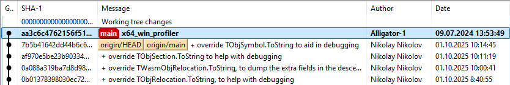
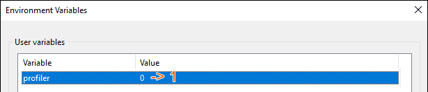

#### Current capabilities and limitations:
- Instrumentation profiler ⚙️
- Supports multithreaded applications 🧵
- Works only on Windows x64 🪟 (to work on Linux x64 🐧, you need to edit small assembly inserts; for other options, you will probably also need to make changes to the patch code itself)

#### Steps to use:
1. Apply the patch to FPC: `cpuprofiler\FPC_patch\0001-x64_win_profiler.patch`
   
2. Build FPC
3. Build the profiler DLL project: `cpuprofiler\dll\profiler.lpr`
4. Add the `cpuprofiler\dll\profiler_proxy.pas` file as the first unit in the uses section to your project, e.g., in the file `yourprojectname.lpr`
5. Insert the `profiler_proxy.profiler_init` function call at the very beginning of your program, for example, in the same `yourprojectname.lpr` file (in fact, you can insert it not only at the beginning, but at the beginning of the section of code you are interested in)
   Calling this function measures the frequency of the processor's TSC counter
6. Insert a call to the `profiler_proxy.profiler_reset` function at the very end of your program, for example, in the same `yourprojectname.lpr` file (in fact, you can insert it not only at the end of the program, but also at the end of the section of code you are interested in) Calling this function will save the profiling results file to disk next to the DLL you compiled in step 3 above
7. Create an environment variable `profiler` and set its value to `1` (the value `1` means that when compiling code, FPC will insert profiler call code at the beginning and end of each function or procedure; if you need to disable this (i.e., disable the profiler), you can enter any other value)
   
8. Move the DLL compiled in step 3 to the folder where your project's executable file will be located
9. Compile your project with debug information generation (DWARF) (it is advisable to do a full recompilation of the project, because the profiler will only be embedded in those files that have been compiled; if some files have not been compiled because they have not been changed, the profiler code will not be embedded in them, so it is advisable to do a full recompilation of the entire project the first time)
10. Start your project for execution
11. Stop your project
12. A `*.cpuprof` file should appear next to the executable project file
13. Analyze the results using `cpuprofiler\viewer`
    To work with this tool, you need to load the `*.cpuprof` file and the project executable file (which serves as a source of debugging information) into it
14. Well, at the moment, it seems that it will only work within the main executable file. If your project is split into several files: an executable file and shared libraries, then it will not be possible to display names for the library code. I haven't worked on this
