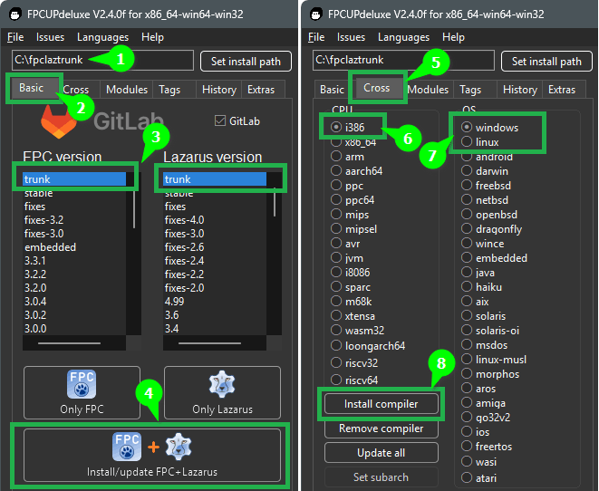

Шаг №0 - [Качаем FPCUpDeluxe](https://web.kek)\
Затем:
1. Указать путь, по которому будут загружены исходные файлы `FPC`, `Lazarus`, вспомогательных программ и по этому же пути будут установлены новые, скомпилированные версии `FPC` и `Lazarus`
2. Перейди на вкладку `Basic`
3. Выбери версии `Trunk` из списка `FPC` и `Lazarus` — это означает последние версии!
4. Нажмите `Install/update FPC+Lazarus`\
Начнется компиляция.\
Ее продолжительность зависит от мощности вашего компьютера. Займет, например, около 15 минут. И после завершения - бпоявится зеленая надпись `SUCCESS` - значит всё готово - можно приступать к использованию.

В целом, на этом можно завершить, если вам нужны только современные 64-разрядные приложения\
Если же вам также нужны 32-разрядные приложения - то нужно ещё сделать ещё несколько шагов:

5. Перейти на вкладку «Cross»
6. Указать архитектуру процессора, для которой вам нужен компилятор (по всей видимости это будет - `i386`)
7. Указать операционную систему (вероятно, `Linux`, если вы используете Linux, или `Windows`, если вы используете Windows) — у меня выбрано `Windows`, потому-что я использую Windows
8. Нажмите `Install compiler` — это установит дополнительный компилятор (`x86`), чтобы вы могли компилировать как `x64`, так и `x32` приложения\
На этом этапе снова будет происходить компиляций свежайшего компилятора, поэтому нужно подождать, примерно как в п.4.

Всё - готово! Да прибудет с вами Pascal-сила!

