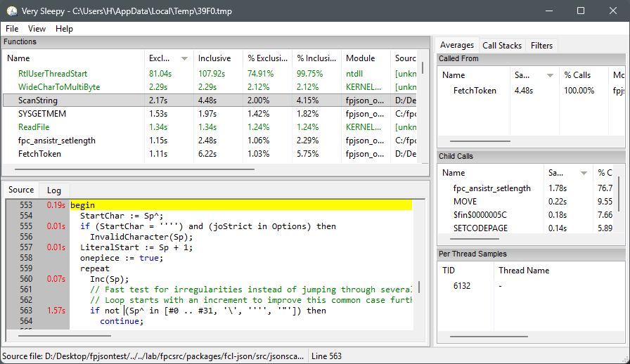
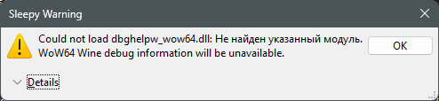
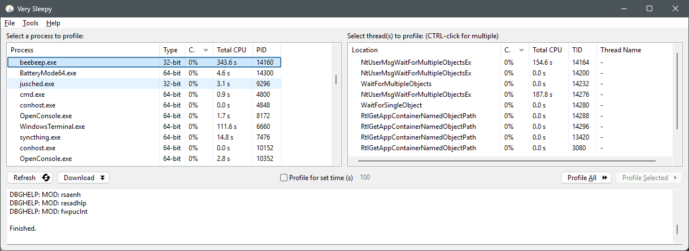
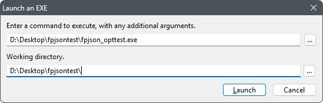
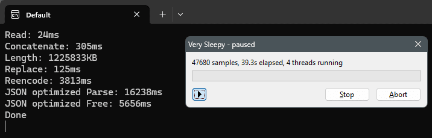
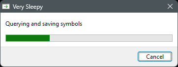

Picture to attract attention

Hello everyone, this is a short guide for working with [Very Sleepy](github.com/VerySleepy/verysleepy) - a sampling profiler that can read symbol names from PDB format and DWARF format debugging information, which means it is suitable for us - FPC/Lazarus users

As of today (January 2026), the project has not had any releases for a long time. However, this is not particularly important, as the basic principles and profiling methods have not changed. Therefore, this project should not be considered dead or undeveloped, as it fulfills its tasks quite well

Nevertheless, I updated my version of Very Sleepy to the nightly build version and also updated the DWARF reading libraries to the latest versions. I will attach my Very Sleepy build at the end of this guide

---

So, working with the profiler is quite simple:

1. Launch

2. If you use my Very Sleepy build, you will see the following warnings:
   
   
   
   You can safely ignore them - they are complaints about the fact that he couldn't find some libraries, but we won't need them anyway. I deliberately removed them from the distribution because we don't need them. If you have the original project, you won't see these warnings.

3. In the main window of the profiler
   
   
   
   You can start profiling in two ways:
   
   - The first method is to select any running process from the list on the left and double-click to start profiling (or click the Profile All button)
   
   - The second method is to start profiling from the moment the application is launched. To do this, select File -> Launch from the menu, and the following dialog box will appear:
     
     
     
     In which you need to specify the path to the executable file and, if necessary, specify the working directory of the application (as a rule, this is the same directory where the executable file itself is located)
     Then press the `Launch` button.

4. After you start profiling using one of the methods, the following window will appear
   
   
   
   Here, we will be most interested in the `Stop` button

5. Then, after starting profiling, you should perform the actions in the application whose performance you are interested in, such as running a long calculation or something that causes slowdowns
   
   The more and longer you initiate the execution of actions that interest you by the program, the more samples the profiler will collect and the more accurate its results will be

6. Once you have collected enough statistics, press the `Stop` button
   
   
   ⚠️ Attention! In the next step, the profiler will begin collecting the information it needs from the running process—in particular, information about symbols (so that we can see the unit name, line number, and function name, rather than just an incomprehensible address)
   
   
   Therefore, in order for everything to work correctly, your application must still be running when you press the `Stop` button and while this information is being collected. For example, in a console application, add `ReadLn;` at the end, and in a GUI application, simply do not close it

7. Now you have clicked the `Stop` button - this window will appear for a while
   
   
   
   This is where the procedures I described above in point 6 are being carried out

8. Once all data has been collected, the profiling results will appear
   
   
   
   Now, if necessary, you can close the applications you have profiled

That's all. How to interpret and deal with profiling results - try to figure it out for yourself (but if anyone wants to add to this guide, I'm open to reviewing your edits and additions, or you can make a fork)

---

My version of Very Sleepy: [VerySleepy nightly + updated libs](VerySleepy_nightly_and_updated_libs.zip)

---

📝 Note: Often, for a better understanding, it can be helpful to understand what is happening not only in your code, but also in the RTL FPC and/or LCL Lazarus code and other parts of your program

Release distributions are distributed without debugging information, so you will not see information about these parts of your program in the profiler **in a human-readable form**, only addresses

Therefore, I recommend rebuilding Lazarus with debugging information. This can be done via the Tools menu -> Configure "Build Lazarus" -> select "Debug IDE" in Profile to build -> click "Build"

This will give you debug information in LCL/Lazarus, but it will not give you debug information in RTL FPC. To have debug information in RTL FPC, you need to compile FPC from source. This can also be done in several ways - manually via the console or using the convenient program [FPCUpDeluxe](https://github.com/LongDirtyAnimAlf/fpcupdeluxe)
